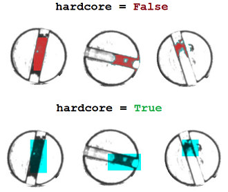

# Anomaly Detection Pipeline
## What is Anomaly Detection and when do we use it?
In most quality inspection scenarios, we have an abundance of good, non defective data and very little bad or defective data. In these situations, the idea is to make a model learn what a good or acceptable image is and if there is an image which does deviates too much from this good image, we can classify that as an anomaly and have the model point out the area that it feels makes the part an anomaly. 

These systems are mainly used in the cases where the ratio of good to bad data is very skewed and "learns" what a good image is supposed to look like. Images that deviate from this are considered anomalies. Based on how much deviation is allowed, thresholds can be changed. 

## Function Definitions:
### 1. __AD(model_name="AD1", train_path="Dataset/", gray_scale=True, save_path="Models/", img_size=(200,200), patch_size=40)__
The same constructor is used for creating a model as well as loading a pretrained model. The definition above provides the default values of the variables provided. 
The patch size should always be bigger than the largest possible defect. If there is a very large range of anomalies to be detected, I suggest training two separate models, one for the smaller anomalies and the other for larger defects. 

#### Simplest model creation:
```python
ad = AD("AD1")
```
#### Loading a pretrained model:
```python
ad = AD("Models/model")
```

### 2. __AD.load\_data(path)__
Since we are dealing with image data, all files image files like ``` *.jpg, *.jpeg, *.png, *.bmp ``` will be automatically loaded. The images are also resized to the ```img_size``` value provided. 
```python
ad.load_data("Dataset/Train/")
``` 

### 3. __AD.train(epochs)__
The system automatically creates the train and validation split for ease of use. For most cases, we start seeing good results around 75 epochs. Complex images may require more epochs. 
```pytohn
ad.train(75)
```

### 4. __AD.test_img(path_to_img)__
This function is used to see what kind of reconstruction we are currently getting. This gives us a good idea of if there is any error, if we are along the right track and more. The reconstructed image will be on the right and the original image will be on the left. If the reconstructed image looks similar to the original image, we are on the right path.
```python
ad.test_img("Dataset/Train/0.jpg")
```

### 5. __AD.predict(path, save_path="Output/", show=False, save=True, patch_size=0, thresh=0.8, hardcore=False)__
The predict function works on both single images as well as a folder containing images. You have the option of choosing the save path if you want to save the output images. You can also change the threshold based on your use case. The ```hardcore``` mode is a more aggressive error showing method which will display boxes of size ``` patch_size``` that it believes are anomalies. With ```hardcore``` set to ```False```, the system exactly builds heatmaps on the spots it believes are deviating from the normal. The figure below shows the difference between the two modes. 



#### Single image prediction:
```python
ad.predict("Dataset/Test/0.jpg", "Output/")
```

### Folder prediction:
```python
ad.predict("Dataset/Test/", "Output/")
```

## Example:
Common examples are provided in [Example.py](./Example.py)

## Folder structure to be followed:
The _Train_ folder contains only good or non anomalous images. The _Test_ folder contain images that do have defects and are used to set the thresholds and check the efficiency of the system.
```
Root
    |--- Train
    |   |--- File1.jpg
    |   |--- File2.jpg
    |   |--- File3.jpg
    |   |--- ...
    |--- Test
    |   |--- File1.jpg
    |   |--- File2.jpg
    |   |--- File3.jpg
    |   |--- ...

```

